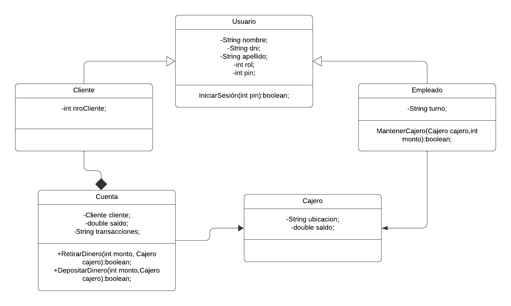

<!DOCTYPE html>
<html lang="en">
<head>
    <meta charset="UTF-8">
    <meta name="viewport" content="width=device-width, initial-scale=1.0">
 
</head>
<body>
    <h1>Ejercicio cajero</h1>
    
        
Lorem ipsum dolor sit amet consectetur adipisicing elit. Sed sit non velit. Reprehenderit facilis itaque vel magnam aut, quia molestiae nemo corrupti et, voluptas aliquid nulla repudiandae. Corrupti, blanditiis. Quibusdam?

</body>
</html>
